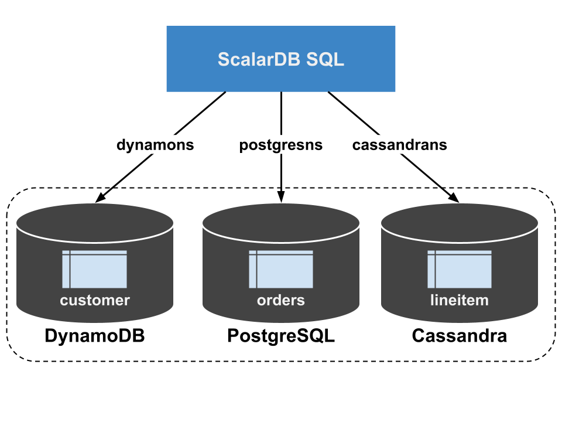
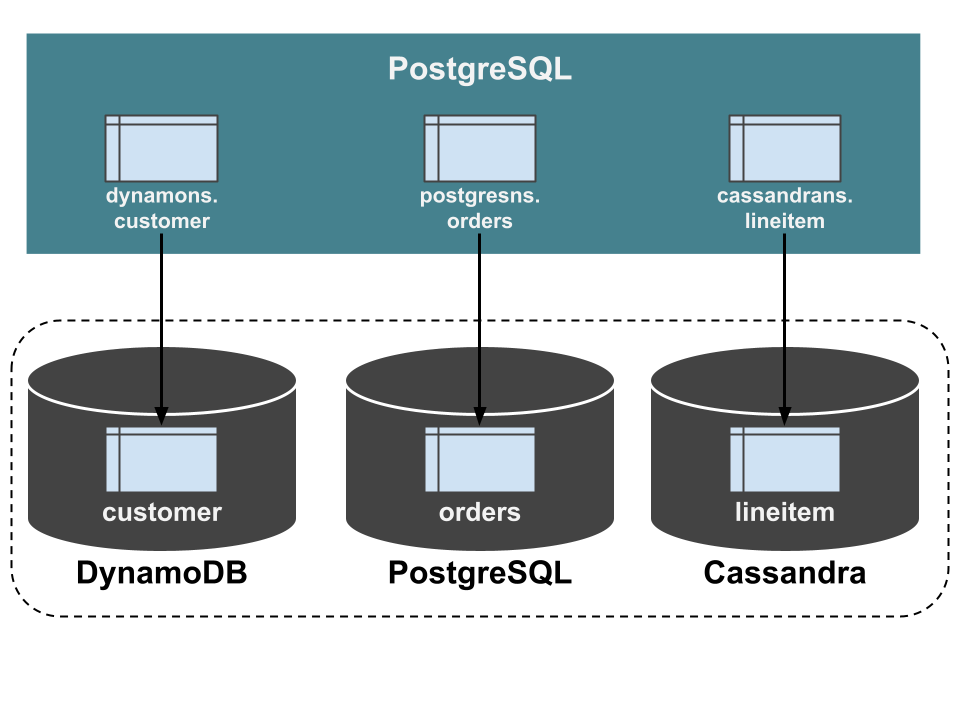

# Getting Started with ScalarDB Analytics with PostgreSQL

This document explains how to get started with ScalarDB Analytics with PostgreSQL. We assume that you have already installed ScalarDB Analytics with PostgreSQL and that all required services are running. If you don't have such an environment, please follow the instructions in [How to Install ScalarDB Analytics with PostgreSQL in Your Local Environment by Using Docker](./installation.md). Because ScalarDB Analytics with PostgreSQL executes queries via PostgreSQL, we also assume that you already have a `psql` client or another PostgreSQL client to send queries to PostgreSQL.

## What is ScalarDB Analytics with PostgreSQL?

ScalarDB, as a universal transaction manager, targets mainly transactional workloads and therefore supports limited subsets of relational queries.

ScalarDB Analytics with PostgreSQL extends the functionality of ScalarDB to process analytical queries on ScalarDB-managed data by using PostgreSQL and its foreign data wrapper (FDW) extension.

ScalarDB Analytics with PostgreSQL mainly consists of two components: PostgreSQL and Schema Importer.

PostgreSQL runs as a service, accepting queries from users to process. FDW extensions are used to read data from the back-end storages that ScalarDB manages. Schema Importer is a tool to import the schema of the ScalarDB database into PostgreSQL so that users can see tables on the PostgreSQL side, which are identical to the tables on the ScalarDB side.

## Set up a ScalarDB database

First, you need one or more ScalarDB databases to run analytical queries with ScalarDB Analytics with PostgreSQL. If you have your own ScalarDB database, you can skip this section and use your database instead. If you use the [scalardb-samples/scalardb-analytics-postgresql-sample](https://github.com/scalar-labs/scalardb-samples/tree/main/scalardb-analytics-postgresql-sample) project, you can set up a sample database by running the following command in the project directory.

```shell
$ docker compose run --rm schema-loader \
  -c /etc/scalardb.properties \
  --schema-file /etc/schema.json \
  --coordinator \
  --no-backup \
  --no-scaling
```

This command sets up [multiple storage instances](https://scalardb.scalar-labs.com/docs/latest/multi-storage-transactions/) that consist of DynamoDB, PostgreSQL, and Cassandra. Then, the command creates namespaces for `dynamons`, `postgresns`, and `cassandrans` that are mapped to those storages, creates tables for `dynamons.customer`, `postgresns.orders`, and `cassandrans.lineitem` by using [ScalarDB Schema Loader](https://scalardb.scalar-labs.com/docs/latest/schema-loader/).



You can load sample data into the created tables by running the following command.

```console
$ docker compose run --rm sample-data-loader
```

## Import the schemas from ScalarDB into PostgreSQL

Next, let's import the schemas of the ScalarDB databases into PostgreSQL that processes analytical queries. ScalarDB Analytics with PostgreSQL provides a tool, Schema Importer, for this purpose. It'll get everything in place to run analytical queries for you.

```shell
$ docker compose run --rm schema-importer \
  import \
  --config /etc/scalardb.properties \
  --host analytics \
  --port 5432 \
  --database test \
  --user postgres \
  --password postgres \
  --namespace cassandrans \
  --namespace postgresns \
  --namespace dynamons \
  --config-on-postgres-host /etc/scalardb.properties
```

If you use your own ScalarDB database, you must replace the `--config` and `--config-on-postgres-host` options with your ScalarDB configuration file and the `--namespace` options with your ScalarDB namespaces to import.

This creates tables (in precise, views) with the same names as the tables in the ScalarDB databases. In this example, the tables of `dynamons.customer`, `postgresns.orders`, and `cassandrans.lineitem` are created. The column definitions are also identical to the ScalarDB databases. These tables are [foreign tables](https://www.postgresql.org/docs/current/sql-createforeigntable.html) connected to the underlying storage of the ScalarDB databases using FDW. Therefore, you can equate those tables in PostgreSQL with the tables in the ScalarDB databases.



## Run analytical queries

Now, you have all tables to read the same data in the ScalarDB databases and can run any arbitrary analytical queries supported by PostgreSQL. To run queries, please connect to PostgreSQL with `psql` or other client.

```shell
$ psql -U postgres -h localhost test
Password for user postgres:

> select c_mktsegment, count(*) from dynamons.customer group by c_mktsegment;
 c_mktsegment | count
--------------+-------
 AUTOMOBILE   |     4
 BUILDING     |     2
 FURNITURE    |     1
 HOUSEHOLD    |     2
 MACHINERY    |     1
(5 rows)
```

For details about the sample data and additional practical work, see the sample application page.

## Caveats

### Isolation level

ScalarDB Analytics with PostgreSQL reads data with the **Read Committed** isolation level set. This isolation level ensures that the data you read has been committed in the past but does not guarantee that you can read consistent data at a particular point in time.

### Write operations are not supported

ScalarDB Analytics with PostgreSQL only supports read-only queries. `INSERT`, `UPDATE`, and other write operations are not supported.
